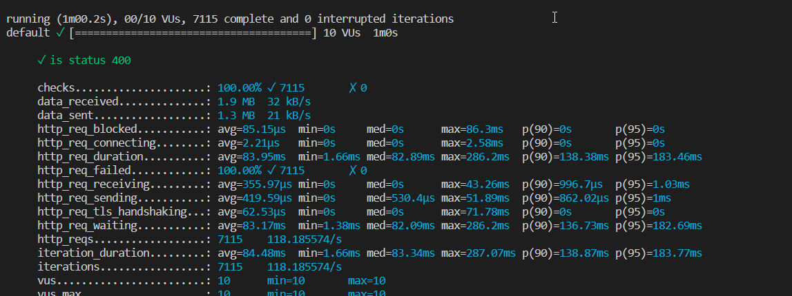
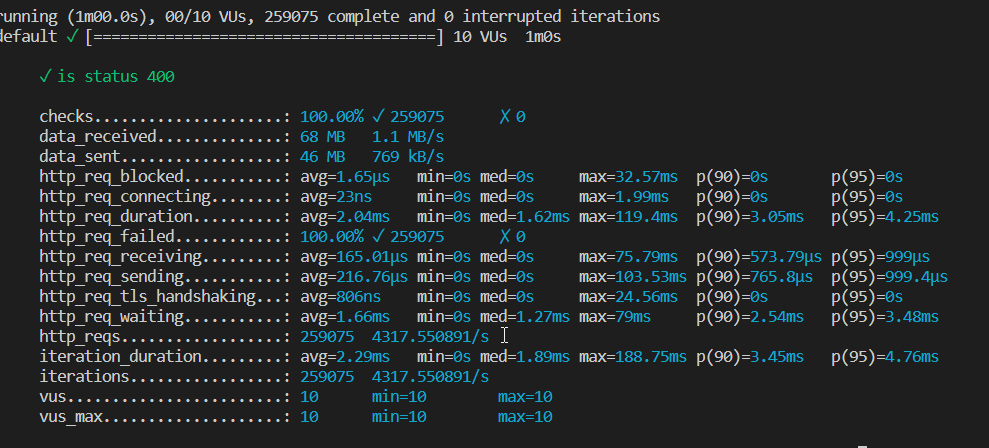

# Control Flow

## Using Exceptions

Create custom Exception for each domain business case and map it to message/status codes
ex:

see [DuplicateUsernameException.cs](/Identity.Api/Domain/Common/Exceptions/DuplicateUsernameException.cs) implementing [IDomainException](/Identity.Api/Domain/Common/Exceptions/IDomainException.cs) and [controller implementation](/Identity.Api/Controllers/ErrorsController.cs)

Load test result for exception flow

## Using Functional Patterns

Create custom structs/classes for each domain error in business case and map it to message/status codes

### Using OneOf

Using Nuget Package OneOf

see [DuplicateUsernameError.cs](/Identity.Api/Domain/Common/Errors/DuplicateUsernameError.cs) implementing [IError](/Identity.Api/Domain/Common/Errors/IError.cs) and [controller implementation](/Identity.Api/Controllers/AuthController.cs)

and implementation of [IAuthService.Register](/Identity.Api/Domain/Services/AuthService.cs)

Load test result for Result flow

### Using FluentResults

[FluentResults](https://github.com/altmann/FluentResults)

- [https://medium.com/@michael_altmann/error-handling-returning-results-2b88b5ea11e9](https://medium.com/@michael_altmann/error-handling-returning-results-2b88b5ea11e9)

### Using ErrorOr

A simple, fluent discriminated union of an error or a result.
[ErrorOr](https://github.com/amantinband/error-or)